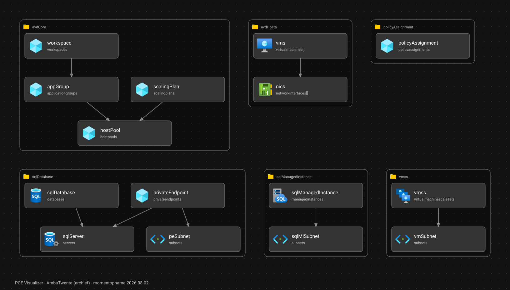

# PCE-Visualizer

Bouwt een plattegrond van je Azure-infrastructuur uit je Bicep-modules: welke resources er komen te staan
en hoe ze van elkaar afhangen. Als interactieve website, en als statische SVG voor in je README.

> [!IMPORTANT]
> **Gearchiveerd.** Het PCE-project is afgerond. De dagelijkse pipeline is gestopt en de live-site op
> `pce-poc.b-cdn.net` bestaat niet meer. Wat de visualizer als laatste liet zien staat hieronder als
> vaste afbeelding. De code wordt niet meer onderhouden, maar is wel opgezet om als template te
> hergebruiken — zie [Zelf gebruiken als template](#zelf-gebruiken-als-template).

## De laatste stand van zaken

Dit is de infrastructuur zoals de visualizer die uit de Bicep-modules van
[PCE-PoC](https://github.com/ambutwente/PCE-PoC) heeft opgebouwd — 15 Azure-resources, verdeeld over 6 modules:



Elk kader is één `.bicep`-module. De blokjes daarin zijn de resources die Azure zou aanmaken, en de pijlen
wijzen naar datgene waarvan een resource afhankelijk is. Een `[]` achter het type betekent dat de resource
in een `[for]`-lus zit en dus meerdere keren uitgerold wordt.

De afbeelding is een gewone SVG zonder scripts of externe verwijzingen: geen CDN, geen netwerkverkeer,
niets dat kan verlopen of geld kost.

## Zelf gebruiken als template

Je hebt hier niets van het PCE-project voor nodig — de visualizer leest gewoon jouw Bicep-modules.

**Stap 1.** Klik op *Use this template* (of fork de repository).

**Stap 2.** Pas [`visualizer.config.json`](visualizer.config.json) aan. Dat is het enige bestand dat je
moet aanraken; alle scripts, de build en de website lezen hieruit:

| Sleutel | Wat je invult | Voorbeeld |
| --- | --- | --- |
| `title` | Naam van je project, komt in de browsertitel | `"Contoso-Visualizer"` |
| `source.repository` | De repository met je Bicep-modules, als `owner/repo` | `"contoso/infra"` |
| `source.modulesPath` | De map daarbinnen met `.bicep`-bestanden | `"modules"` |
| **`site.url`** | **De URL waar jouw site komt te staan.** Leeg laten betekent: geen live site | `"https://contoso.github.io/visualizer/"` |
| **`site.basePath`** | **Het pad waaronder de site draait.** Op GitHub Pages `"/<repo-naam>/"`, op een eigen domein `"/"` | `"/visualizer/"` |
| `footer.label` / `footer.url` | Het linkje linksonder in beeld | `"Contoso Infra"` |

> [!WARNING]
> `site.basePath` is het veld dat mensen vergeten. Staat die op `"/"` terwijl je site op
> `https://jouw-naam.github.io/jouw-repo/` draait, dan laadt de pagina wel maar blijven de afbeeldingen
> en scripts leeg.

**Stap 3.** Staan je Bicep-modules in een private repository? Zet dan een repository-secret
`SOURCE_REPO_TOKEN` met een token dat die repository mag lezen. Is hij publiek, dan hoef je niets te doen.

**Stap 4.** Start de workflow **Graaf en momentopname verversen** (Actions-tabblad, *Run workflow*).
Die leest je modules, bouwt de graaf en commit `public/graph.json` plus een verse
`docs/graph-snapshot.svg` terug. Verwijs vanuit je eigen README naar die SVG.

**Stap 5 (optioneel).** Wil je ook een echte website? Zet in *Settings → Pages* de bron op
**GitHub Actions** en start de workflow **Site publiceren op GitHub Pages**. Dat is gratis en heeft geen
externe hosting of API-sleutels nodig.

Geen van de workflows draait vanzelf: er staat geen cron en geen trigger op `push`. Je drukt zelf op de
knop wanneer je iets wilt verversen. Dat is bewust — dit project is precies daarom geen abonnement meer.

## Lokaal draaien

```bash
npm ci
npm run dev      # http://localhost:5201
```

De graaf opnieuw opbouwen uit een lokale kopie van je Bicep-modules:

```bash
MODULES_DIR=/pad/naar/jouw-repo/modules npm run graph
```

En daar de statische afbeelding van maken:

```bash
npm run snapshot     # schrijft docs/graph-snapshot.svg
```

De snapshot gebruikt dezelfde ELK-layout, hetzelfde donkere thema en dezelfde Azure-iconen als de
interactieve versie, en levert bij elke run hetzelfde bestand op — een diff betekent dus echt dat er iets
aan je infrastructuur veranderd is.

## Wat is dit?

PCE-Visualizer is een fork van het open-source project [bicep-visualizer](https://github.com/aipx-proto/bicep-visualizer), beschikbaar onder de [MIT-licentie](THIRD_PARTY_NOTICES.md).

De visualisatie die je ziet lijkt op wat de Bicep-extensie in Visual Studio Code laat zien als je een `.bicep`-bestand opent. Wij hebben die visualisatie-engine hergebruikt om onze eigen modules in kaart te brengen.

> [!NOTE]
> Deze repository is geen onderdeel van de officiële scope of het onderzoeksrapport van het PCE-project.
> Het is een intern hulpmiddel dat wij zelf hebben opgezet om onze Bicep-infrastructuur beter te kunnen uitleggen aan elkaar.

## Waarvoor hebben wij het gebruikt?

Tijdens het project werden er steeds meer Bicep-modules aangemaakt in de [PCE-PoC](https://github.com/ambutwente/PCE-PoC) repository. Om intern beter uit te kunnen leggen welke Azure-resources onze pipeline zou gaan deployen en hoe die met elkaar samenhangen, hebben wij deze visualizer opgezet.

Het was eigenlijk een soort "wat als we dit uitrollen" overzicht: je ziet precies welke resources er in Azure zouden komen te staan en hoe ze aan elkaar gekoppeld zijn.

Er staat geen Bicep-code in deze repository zelf. Die wordt alleen tijdelijk ingelezen tijdens een workflow-run
en daarna weggegooid. Wat blijft staan is de graaf: [`public/graph.json`](public/graph.json). Daarmee draait
de visualizer zonder toegang tot PCE-PoC en zonder tokens of hosting-secrets.

## Wat is er bij het archiveren veranderd?

- De deploy naar het betaalde CDN is vervallen. Er wordt niets meer geüpload en er draait geen dagelijkse job.
- Alle workflows starten alleen nog handmatig via `workflow_dispatch`.
- De laatste graaf staat nu in de repository in plaats van in `.gitignore`, samen met de SVG-momentopname.
- Alles wat projectspecifiek was, is verplaatst naar `visualizer.config.json`, zodat de repository als
  template bruikbaar is.
- Alle dependencies zijn een laatste keer bijgewerkt.
- `scripts/generate-graph.mjs` miste twee soorten afhankelijkheden: verwijzingen met een index
  (`nics[i].id`, zoals resources in een `[for]`-lus naar elkaar verwijzen) en `parent:`-relaties tussen een
  resource en zijn child. Die zijn toegevoegd, zodat de bevroren graaf klopt in plaats van een paar
  resources los te laten staan. Daardoor telt de graaf 9 in plaats van 7 verbindingen.

## Status

Dit was een interne fork voor eigen gebruik. Het project is afgerond en wordt niet meer onderhouden.
Gebruik het gerust als startpunt, maar verwacht geen updates of ondersteuning.

De volledige licentie van de overgenomen visualisatie-engine staat in [`THIRD_PARTY_NOTICES.md`](THIRD_PARTY_NOTICES.md).
